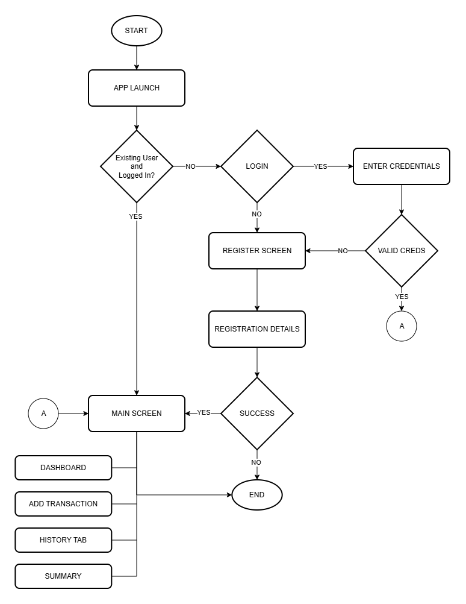

# Budget Tracker
A Mobile Budget Tracker Application

## Setup Guide
- Clone the repository
```bash
git clone https://github.com/valjhoncine/Budget_Tracker.git;
cd Budget_Tracker;
```
- Install Dependencies
```bash
npm install;
npx expo install;
```
- Run the application
```bash
npx expo start;
```
- Press (a) to open android application.

## Project Description
- Budgetly is a mobile application built with React Native (Expo) that allows users to monitor their personal finances. It enables users to record income and expenses, view transaction history, and analyze monthly spending patterns. 

## Core Features

### Login / Register
- Secure email and password authentication and user sessions are persisted across app restarts. 

### Add Income or Expense
Users can add transactions with:
- Title
- Amount
- Type (Income or Expense)
- Category (Food, Salary, Bills, Transport, etc.)

### Dashboard
- An overview displaying total balance, total income, and total expenses computed from all transactions. 

### Transaction History 
Shows all transactions ordered by date.

Each transaction contains:
- Title
- Category
- Date
- Amount
  
### Delete Transaction 
- Users can remove any transaction with a confirmation prompt. Summary Transactions - are maybe grouped by month, displaying income, expense, and net balance per month with an income-vs-expense progress bar. 

## System Flow


### Screen-by-Screen User Flow 
#### Dashboard Screen 
- Computes income total, expense total, and balance. Displays the 5 most recent transactions below the summary cards.

#### Add Transaction Screen 
- User selects type (Expense / Income), enters an amount and title, then picks a category chip. 

#### Transaction History Screen 
- Displays the full transaction list, each item has a delete button. Deletion is reflected  instantly across all screens. 

#### Summary Screen 
- Reads the same transaction list and groups entries by year-month key. For each month  it shows income, expense, and net balance, plus a color-coded progress bar proportional to income vs. expense split.
